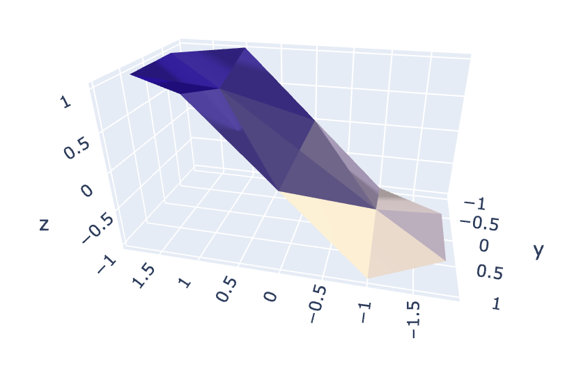

# finite-elements

Implementation of a powerful finite element method for finding numerical
approximations to the solutions to boundary value problems involving both ordinary and
partial differential equations can be solved by direct integration. The method relies on the
characterization of the solution as the minimizer of a suitable quadratic functional.

